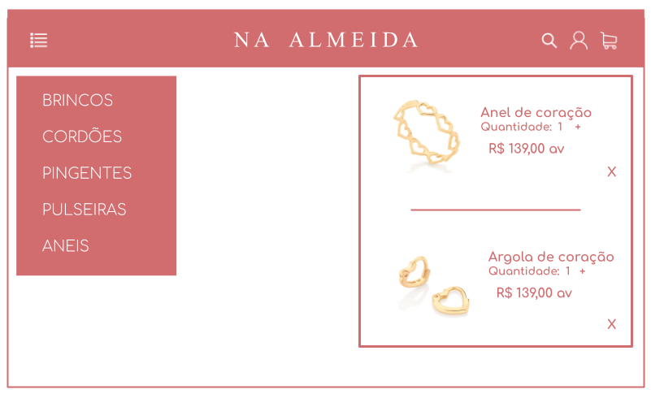
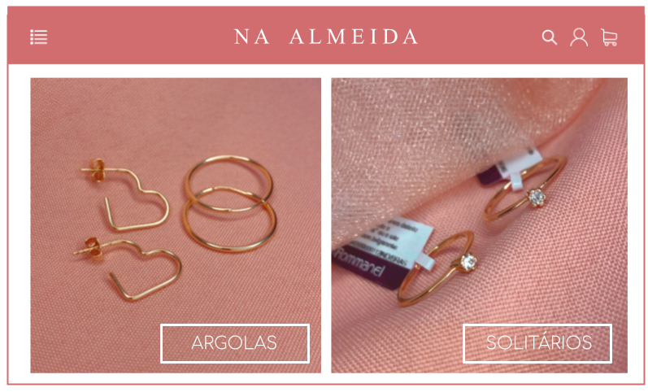

# **CSI606-2021-02 - Remoto - Proposta de Trabalho Final**

## *Aluna: Natália Pereira de Almeida*

--------------

<!-- Descrever um resumo sobre o trabalho. -->

### Resumo

  Este trabalho tem por objetivo principal desenvolver um Sistema Web para vendas de semijoias. Destaca-se que nele se apresentará toda a parte de desenvolvimento, bem como o seu escopo, as restrições e os protótipos. O projeto será construído como um Produto Mínimo Viável (MVP), no entanto, as principais funcionalidades de um e-commerce, como ver produtos por categorias gerais e inserir no carrinho, farão parte do seu escopo. 

<!-- Apresentar o tema. -->
### 1. Tema

  A pandemia do COVID-19, iniciada em 2020, ocasionou em um boom dos e-commerces em virtude da
  necessidade que o mercado teve de se transitar do presencial para o on-line. Portanto, desde
  então, esse tipo de negócio tem sido supervalorizado, e cada vez mais novos horizontes são
  expandidos. 
  Atualmente, sou empreendedora no ramo da joalheria, e todas as minhas vendas são realizadas via
  Whatsapp e Instagram. Tendo em vista o cenário descrito anteriormente, e também em minha
  experiência, o tema escolhido para ser desenvolvido neste trabalho consistirá na união dessas
  duas vertentes: “E-commerce de semijoias: uma aplicação Web de vendas”.

<!-- Descrever e limitar o escopo da aplicação. -->
### 2. Escopo

  Esta seção tem por objetivo definir os requisitos não funcionais e funcionais do sistema em questão.

 # 2.1 Requisitos não funcionais (RNF)

    RNF001: O sistema deve trabalhar no ambiente web;

    RNF002: O sistema deve utilizar um banco de dados, a ser definido posteriormente;
    
    RNF003: O sistema deve possuir  um controle de acesso para o usuário;
    
    RNF004: O sistema deve ser adaptável aos navegadores;
    
    RNF005: O sistema deve seguir o protocolo HTTP;
    
    RNF006: O sistema deve ser responsivo.

  # 2.2 Requisitos funcionais (RF)
    
    RF001: O sistema deve cadastrar e editar as informações de um cliente (usuário);
    
    RF002: O sistema deve permitir ao usuário pesquisar por produtos;
    
    RF003: O sistema deve permitir ao usuário adicionar e remover produtos do carrinho de compras;
    
    RF004: O sistema deve exibir o valor total da compra e as formas de pagamento;
    
    RF005: O sistema deve exibir os produtos por categoria.

<!-- Apresentar restrições de funcionalidades e de escopo. -->
### 3. Restrições

  Este sistema se apresentará como um Produto Mínimo Viável (MVP) de um e-commerce, dessa forma, funcionalidades mais complexas não farão parte do seu escopo, tais como:

      * Pagamentos via cartão de crédito;

      * Cálculos para frete;

      * Geração de nota-fiscal;

<!-- Construir alguns protótipos para a aplicação, disponibilizá-los no Github e descrever o que foi considerado. //-->
### 4. Protótipo

  # 4.1 Main

  

  # 4.2 Menu principal e carrinho de compras 

  

  # 4.3 Home

  

  # 4.4 Produtos por categorias

  

  # 4.5 Especificação do produto

  

