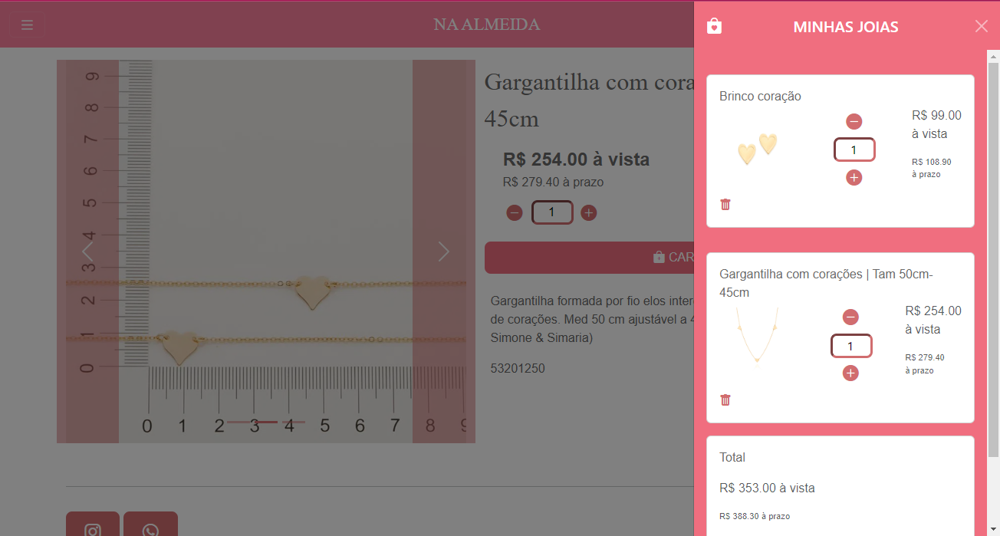
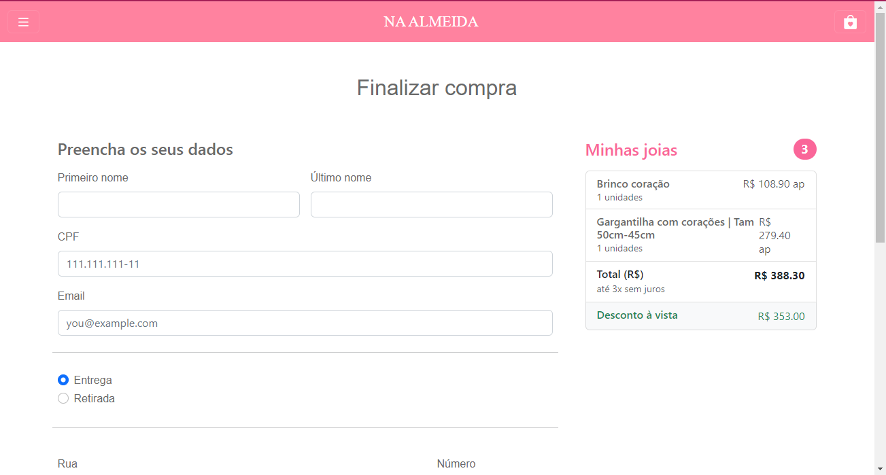
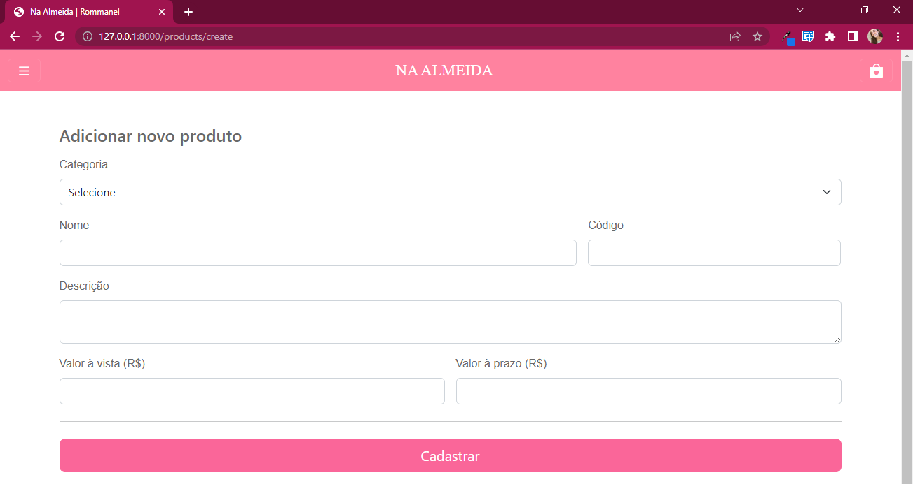
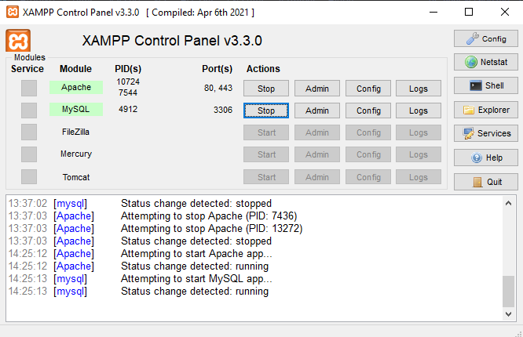
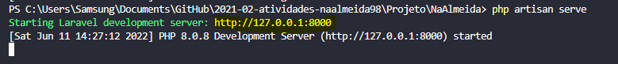

# **CSI606-2021-02 - Remoto - Trabalho Final - Resultados**

## *Aluna: Natália Pereira de Almeida*

--------------

<!-- Este documento tem como objetivo apresentar o projeto desenvolvido, considerando o que foi definido na proposta e o produto final. -->

### Resumo

  Este trabalho teve como objetivo principal desenvolver um e-commerce de semijoias para a disciplina de Sistemas Web I, no curso de Sistemas de Informação da Faculdade Federal de Ouro Preto (UFOP). O sistema foi desenvolvido utilizando o padrão MVC através do framework Laravel, portanto, as principais linguagens utilizadas foram html, css, javascript e php.

### 1. Funcionalidades implementadas
<!-- Descrever as funcionalidades que eram previstas e foram implementas. -->

No sistema em questão foram implementadas as principais telas de uma loja virtual, sendo elas a página home, as páginas dos produtos por categorias, páginas de especificação dos produtos, carrinho de compras e checkout. Confira-as a seguir.

  #### 1.1 Home

  

  #### 1.2 Menu

  

  #### 1.3 Carrinho de compras 

  

  #### 1.4 Produtos

  

  #### 1.5 Produto

  

  #### 1.6 Finalizar compra

  

  #### 1.7 Compra finalizada

  

  

Destaca-se, a seguir, os seguintes requisitos funcionais que foram cobertos:

    RF001 (O sistema deve cadastrar e editar as informações de um cliente): foi implementado parcialmente, dado que o sistema realiza apenas o cadastro na página de checkout;
    
    RF002 (O sistema deve permitir ao usuário pesquisar por produtos): foi implementado parcialmente, dado que o usuário navega pelos produtos pelo menu lateral apenas;
    
    RF003 (O sistema deve permitir ao usuário adicionar e remover produtos do carrinho de compras): foi implementado em sua totalidade;
    
    RF004 (O sistema deve exibir o valor total da compra e as formas de pagamento): foi implementado em sua totalidade;
    
    RF005 (O sistema deve exibir os produtos por categoria): foi implementado em sua totalidade.

Abaixo tem-se os requisitos não funcionais que foram cobertos em sua totalidade:

    RNF001 (O sistema deve trabalhar no ambiente web);

    RNF002 (O sistema deve utilizar um banco de dados);
    
    RNF004 (O sistema deve ser adaptável aos navegadores);
    
    RNF005 (O sistema deve seguir o protocolo HTTP);
    
    RNF006 (O sistema deve ser responsivo).
  
### 2. Funcionalidades previstas e não implementadas
<!-- Descrever as funcionalidades que eram previstas e não foram implementas, apresentando uma breve justificativa do porquê elas não foram incluídas -->

Diante de todo o escopo de requisitos funcionais, apenas os que não foram cobertos são:

    RF001 (O sistema deve cadastrar e editar as informações de um cliente): editar cadastro de cliente não foi implementado;

    RF002 (O sistema deve permitir ao usuário pesquisar por produtos): pesquisar produtos por nome, através de um input na barra de menu, não foi implementado.

E no escopo de requisitos não funcionais, somente não foi coberto:

    RNF003: O sistema deve possuir  um controle de acesso para o usuário.    

### 3. Outras funcionalidades implementadas
<!-- Descrever as funcionalidades implementas além daquelas que foram previstas, caso se aplique.  -->
    
    Foi adicionado uma interface de administração para o cadastro dos produtos. Confira abaixo.

### 4. Principais desafios e dificuldades
<!-- Descrever os principais desafios encontrados no desenvolvimento do trabalho, quais foram as dificuldades e como elas foram superadas e resolvidas. -->

Ressalta-se, em primeiro plano, a maior dificuldade encontrada foi manipular o carrinho de compras, uma vez que para guardar as informações dos produtos escolhidos de maneira temporária, ou seja, sem persistir no banco de dados, foi necessário utilizar a Session do navegador para guardar as informações dos produtos escolhidos pelos usuários, e, infelizmente, essa ferramenta não possui muitos recursos de manipulação. Dessa maneira, para a execução de adição e remoção de objetos dentro do carrinho de compras foi necessária algumas pesquisas e análises para se obter uma solução mais simples. 

Em segundo lugar, a maior dificuldade obtida foi implementar as imagens dos produtos de forma que ficassem responsivas tanto para os formatos desktop e mobile. 

### 5. Instruções para instalação e execução
<!-- Descrever o que deve ser feito para instalar (ou baixar) a aplicação, o que precisa ser configurando (parâmetros, banco de dados e afins) e como executá-la. -->

Para realizar a instalação do sistema deve-se clonar o repositório na máquina. 

Além disso, será necessário a utilização do software XAMPP para ligar o servidor do Banco de Dados. Portanto, caso não tenha instalado, segue o link abaixo para a instalação:

    https://www.apachefriends.org/pt_br/download.html

Após instalado, ative as opções Apache e MySql do XAMPP, conforme a figura a seguir.

  

Em seguida, acesse pelo terminal a pasta do projeto e execute o seguinte comando:

    $ php artisan serve

Por fim, acesse o link apresentado no terminal. Veja adiante.

  

Pronto, você obterá acesso ao sistema.

  

